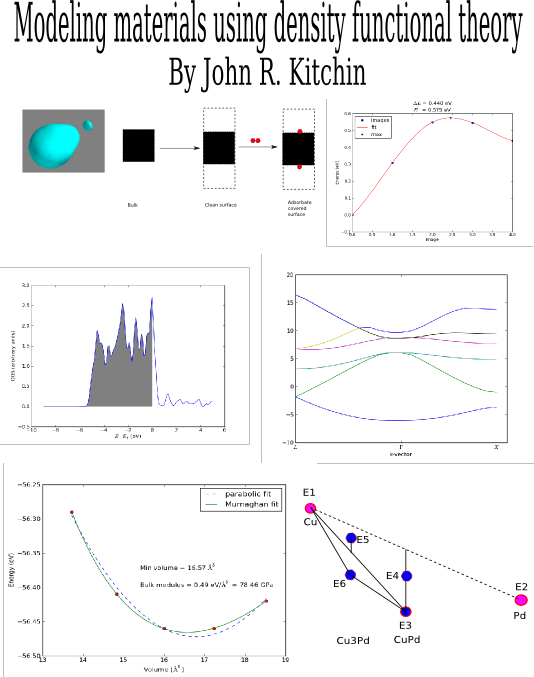

#+TITLE:     Modeling materials using density functional theory
#+AUTHOR:    John Kitchin
#+DRAWERS: HIDDEN HINT SOLUTION
#+EMAIL:     jkitchin@cmu.edu
#+DATE:      2012-07-11 Wed
#+DESCRIPTION: A book on using density functional theory to model materials.
#+KEYWORDS: Density functional theory, materials, VASP
#+INCLUDE: dft-header.org

#+ATTR_LATEX: :width 4in
#+ATTR_HTML: :width 200
#+ATTR_ORG: :width 200

    Copyright \copyright 2012--\the\year\ John Kitchin\par
    Permission is granted to copy, distribute and/or modify this document
    under the terms of the GNU Free Documentation License, Version 1.3
    or any later version published by the Free Software Foundation;
    with no Invariant Sections, no Front-Cover Texts, and no Back-Cover Texts.
    A copy of the license is included in the section entitled "GNU
    Free Documentation License".

#+BEGIN_LaTeX
\maketitle
#+END_LaTeX

#+TOC: headlines 2

#+INCLUDE: "chapters/01-introduction-to-book.org"
#+INCLUDE: "chapters/02-introduction-to-dft.org"
#+INCLUDE: "chapters/03-molecules.org"
#+INCLUDE: "chapters/04-bulk-systems.org"
#+INCLUDE: "chapters/05-surfaces.org"
#+INCLUDE: "chapters/06-atomistic-thermodynamics.org"
#+INCLUDE: "chapters/07-advanced-electronic-structure.org"
#+INCLUDE: "chapters/08-databases.org"
#+INCLUDE: "chapters/09-acknowledgments.org"
#+INCLUDE: "chapters/10-appendices.org"
#+INCLUDE: "chapters/11-python.org"
#+INCLUDE: "chapters/12-references.org"
#+INCLUDE: "chapters/13-gnu-fdl.org"
#+INCLUDE: "chapters/14-index.org"
#+INCLUDE: "chapters/15-build.org"
